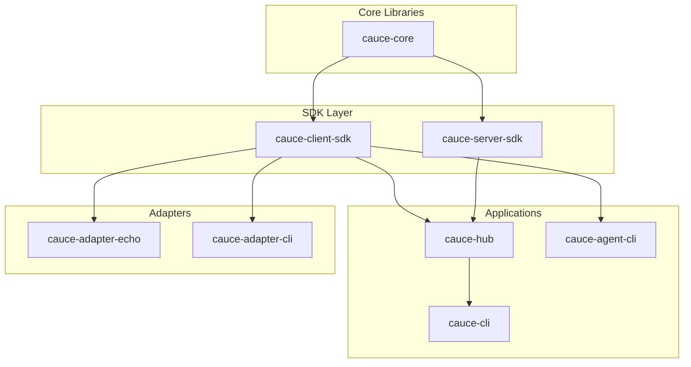
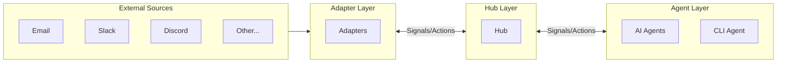

# Cauce-RS Architecture

This document describes the crate structure, dependencies, and responsibilities for the cauce-rs project.

## Overview

Cauce-RS is a Rust reference implementation of the Cauce Protocol, organized as a Cargo workspace with multiple crates. Each crate has a specific responsibility and clear boundaries.

## Crate Overview

| Crate | Status | Description |
|-------|--------|-------------|
| `cauce-core` | Planned | Protocol types, JSON schemas, validation utilities |
| `cauce-client-sdk` | Planned | Client library for connecting to a Cauce Hub |
| `cauce-server-sdk` | Planned | Server library for building Cauce Hubs |
| `cauce-hub` | Planned | Reference Hub implementation with SQLite storage |
| `cauce-cli` | Planned | Hub management command-line interface |
| `cauce-agent-cli` | Planned | Interactive agent REPL for testing |
| `cauce-adapter-echo` | Planned | Testing adapter that mirrors signals |
| `cauce-adapter-cli` | Planned | Stdin/stdout adapter for shell integration |

## Dependency Diagram



## Layer Diagram



## Crate Responsibilities

### cauce-core

**Purpose**: Shared protocol types and utilities used by all other crates.

**Responsibilities**:
- Signal and Action data structures
- JSON-RPC request/response types
- JSON schema validation
- Topic validation and matching
- ID generation utilities
- Error code definitions

### cauce-client-sdk

**Purpose**: Client library for connecting to a Cauce Hub.

**Responsibilities**:
- Hub connection management
- Transport implementations (WebSocket, SSE, Polling)
- Subscription management
- Signal publishing and receiving
- Automatic reconnection with backoff
- Local queue for offline resilience

### cauce-server-sdk

**Purpose**: Server library providing Hub building blocks.

**Responsibilities**:
- Request routing and dispatch
- Subscription manager trait and implementations
- Message router trait and implementations
- Delivery tracker trait and implementations
- Transport handlers (WebSocket, SSE, Polling, Webhook)
- Session management

### cauce-hub

**Purpose**: Reference Hub implementation.

**Responsibilities**:
- SQLite persistence for subscriptions and pending signals
- API key management
- Configuration loading (TOML)
- Health and metrics endpoints
- A2A and MCP integration (when enabled)

### cauce-cli

**Purpose**: Hub management command-line interface.

**Responsibilities**:
- Configuration management
- API key CRUD operations
- Subscription listing and management
- Server status and health checks

### cauce-agent-cli

**Purpose**: Interactive agent for testing and development.

**Responsibilities**:
- REPL interface for sending/receiving signals
- Subscription management
- Signal inspection and acknowledgment
- Action composition and sending

### cauce-adapter-echo

**Purpose**: Testing adapter that mirrors received signals.

**Responsibilities**:
- Subscribe to configurable topics
- Echo received signals to echo topic
- Configurable delay for async testing

### cauce-adapter-cli

**Purpose**: Shell integration adapter.

**Responsibilities**:
- Read lines from stdin, publish as signals
- Subscribe to action topics
- Write action payloads to stdout
- JSON mode for structured I/O

## Crate Boundaries

Per Constitution Principle VI (Component Separation), each crate has explicit boundaries:

### What Adapters Do NOT Do

- Make AI/ML decisions
- Extract or interpret content meaning
- Implement business logic
- Store data beyond local queuing
- Route signals to other adapters

### What Hub Does NOT Do

- Inspect encrypted payloads
- Make content-based routing decisions
- Implement adapter-specific logic
- Store user credentials (only hashed API keys)
- Execute business rules

### What Agents Do NOT Do

- Implement protocol wire format
- Handle transport-level concerns
- Manage subscriptions directly
- Bypass the Hub for communication

## Directory Structure

```
cauce-rs/
├── Cargo.toml          # Workspace manifest
├── crates/
│   ├── cauce-core/
│   ├── cauce-client-sdk/
│   ├── cauce-server-sdk/
│   ├── cauce-hub/
│   ├── cauce-cli/
│   ├── cauce-agent-cli/
│   ├── cauce-adapter-echo/
│   └── cauce-adapter-cli/
├── docs/               # Documentation
├── specs/              # Feature specifications
└── schemas/            # JSON schemas (future)
```

## Related Documentation

- [CONTRIBUTING.md](../CONTRIBUTING.md) - Development guidelines
- [TODO.md](../TODO.md) - Implementation roadmap
- [Constitution](../.specify/memory/constitution.md) - Protocol principles
